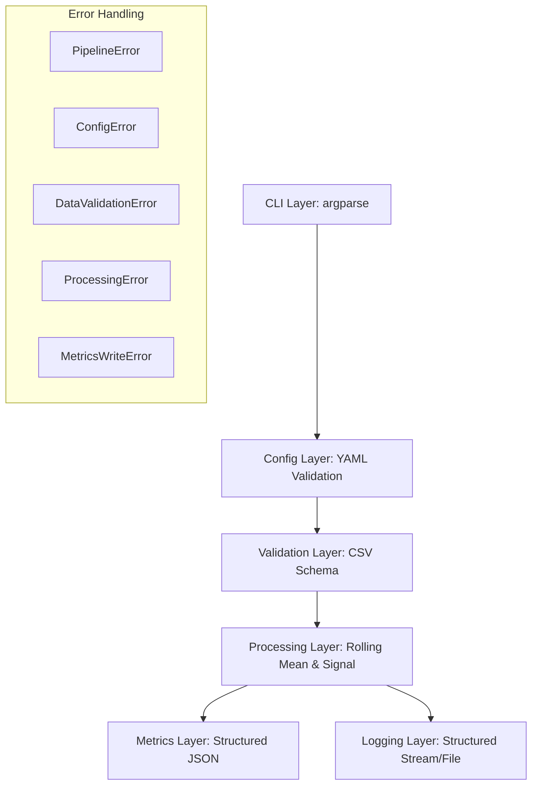

# Deterministic Batch Signal Pipeline

An enterprise-grade, deterministic, and observable batch pipeline for processing financial OHLCV data.

## 🏗 Architecture



## 🔁 Determinism Explanation

Determinism is guaranteed by:
- **Seed Management**: Explicitly setting `numpy.random.seed` from `config.yaml`.
- **Floating Precision**: Standardizing calculations with `pandas` and `numpy`.
- **Output Stability**: Ensuring `metrics.json` uses sorted keys and stable JSON formatting.
- **Process Isolation**: Containerization ensures a consistent environment.

## 🧨 Error Taxonomy

- `ConfigError`: Raised for missing keys, extra keys, or invalid types in `config.yaml`.
- `DataValidationError`: Raised if `data.csv` is missing, unreadable, empty, or lacks required numeric columns.
- `ProcessingError`: Raised for mathematical or data structure failures during signal generation.
- `MetricsWriteError`: Raised if the final `metrics.json` cannot be persisted.

All `PipelineError` subtypes are caught and result in a structured `metrics.json` error output and a non-zero exit code.

## 🪵 Logging Strategy

Standardized logging with the format:
`timestamp | level | module | function | message`

Logs are emitted to both `stderr` (for container observability) and `run.log` (for local persistence).

## 🚀 Execution

### Local Execution

1. Install dependencies:
   ```bash
   pip install -r requirements.txt
   ```
2. Run the pipeline:
   ```bash
   python run.py --input data.csv --config config.yaml --output metrics.json --log-file run.log
   ```

### Docker Execution

1. Build the image:
   ```bash
   docker build -t mlops-task .
   ```
2. Run the container (as specified in evaluation rubric):
   ```bash
   docker run --rm mlops-task
   ```

## 📊 Example Output

### Success Output (`metrics.json`)
```json
{
  "version": "v1",
  "rows_processed": 10000,
  "metric": "signal_rate",
  "value": 0.4990,
  "latency_ms": 127,
  "seed": 42,
  "status": "success"
}
```

### Error Output (`metrics.json`)
```json
{
  "version": "v1",
  "status": "error",
  "error_message": "Description of what went wrong"
}
```
